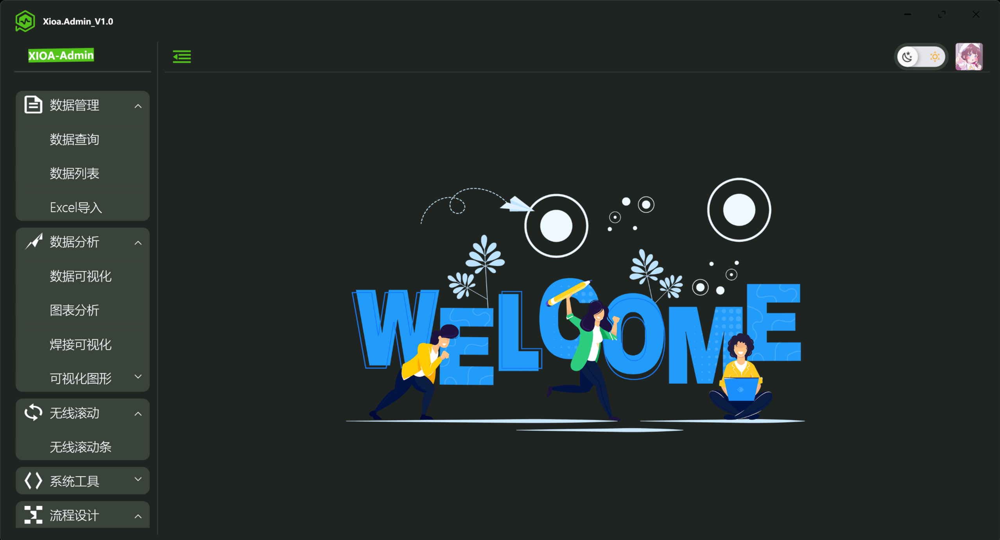
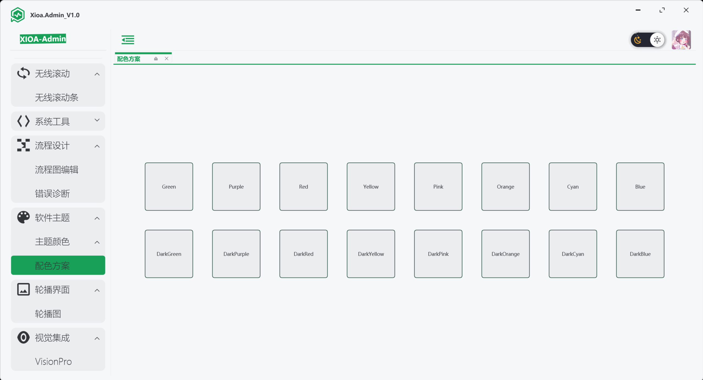
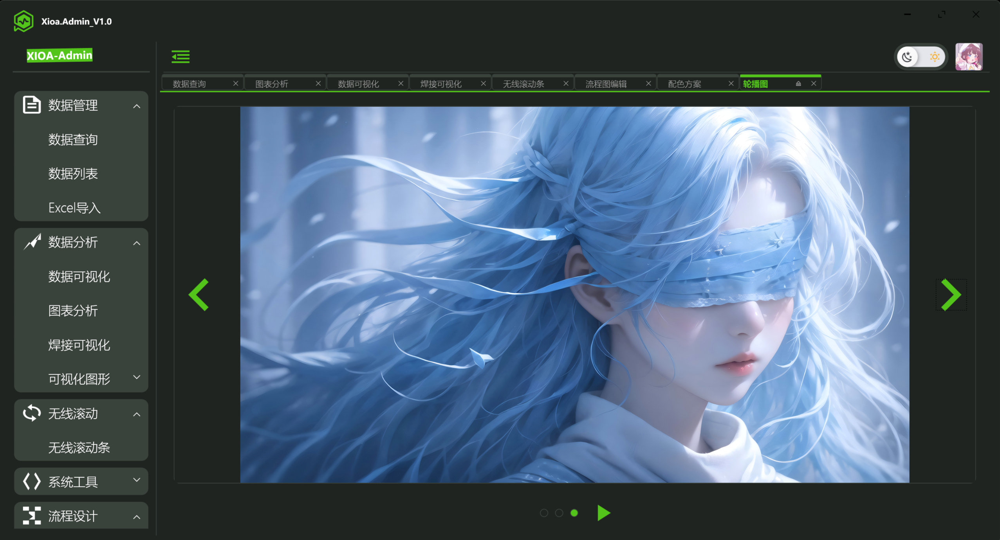
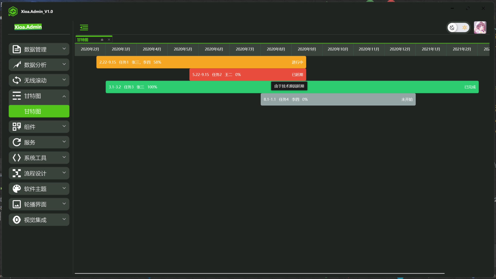

# Xioa-Admin

## 项目简介
Xioa-Admin 是一个基于 WPF .net Core C# 的中后台解决方案，目标是为开发中大型项目提供开箱即用的解决方案。包括二次封装组件、utils、动态菜单、权限校验、按钮级别权限控制等功能。项目会使用前端较新的技术栈，可以作为项目的启动模版，以帮助你快速搭建企业级中后台产品原型。也可以作为一个示例，用于学习 WPF .net Core C# 等主流技术。该项目会持续跟进最新技术，并将其应用在项目中

## 技术栈
- 框架: 前台 WPF (.NET 6.0) 后台 Asp.Net Core
- ORM: EF Core
- 日志：前台 Xioa.WPF.XLog（轻量级实现日志功能） 后台 Nlog
- 请求：Xioa.NAxios （axios.js 功能 .net实现）
- 行为：Xioa.WPF.AttachedBehaviors
- 身份验证：JWT （RefreshToken模式）
- 图表: LiveCharts2.0
- 数据库: SQLite
- UI组件: Handycontrol

## 项目截图
-主页

-导航按钮

-主题

-页固钉

-页弹出与回溯

-甘特图

## 系统架构 🏗️

### MVVM架构
- 清晰的代码分层
- 高度解耦的模块设计
- 便于维护和扩展

### 插件化设计
- 支持动态加载设备驱动
- 可扩展的数据处理模块

### 界面设计
- 采用 Handycontrol 设计语言
- 响应式布局，适配不同分辨率
- 深色/浅色主题切换

## 开发指南

### 添加新设备支持
1. 在 `Models` 中定义设备模型

## 主要功能

### 数据采集 📊
- 多设备并行采集
- 实时数据监控  
- 异常报警提示

### 地图功能 🗺️
- 多地图源支持(百度、高德、谷歌、OpenStreet)
- 设备位置实时显示
- 轨迹回放功能

### 数据分析 📈
- 历史数据查询
- 数据统计分析
- 报表导出功能

### 问题诊断
- 详细日志记录
- 故障快速定位
- 远程诊断支持

## 系统要求
- Windows 7 或更高版本
- .NET 6.0 Runtime
- 最小分辨率 1280x720

## 快速开始

### 安装
1. 克隆仓库

---
📝 本文档持续更新中...
